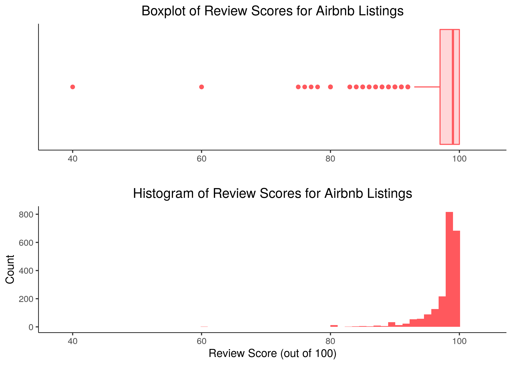
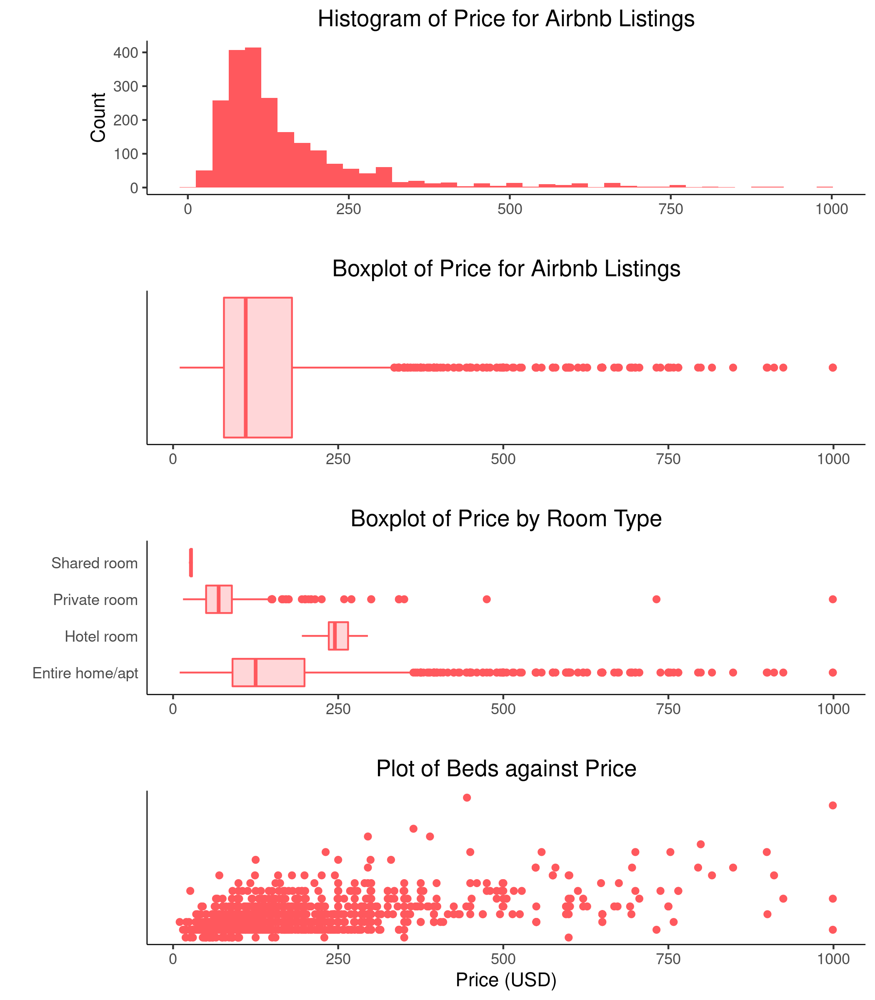

Airbnb Analytics
=================

This repository contains the data, code, and results of an analysis of Airbnbs in Asheville, North Carolina.

## Credits
* Data sourced from: http://insideairbnb.com/get-the-data.html
* Inspiration from: https://towardsdatascience.com/digging-into-airbnb-data-reviews-sentiments-superhosts-and-prices-prediction-part1-6c80ccb26c6a

## Project Proposal

### Dataset

This analysis is based on the listings dataset which was sourced from InsideAirbnb.com and was last updated on June 25, 2020. This dataset contains information on 2,407 different Airbnb listings in Asheville, North Carolina. Examples of included properties are superhost status, price, bedrooms, zipcode, and rating. In total, there are 106 points of data on each property. The motivation behind this analysis is that I am traveling to Asheville next spring for my honeymoon and I want to make sure that our Airbnb booking is a good price.

### Preliminary Figures

### Questions to Answer with Dataset
* Can we predict price based on properties of the listing?
   
### Proposal for Modeling/Advanced Data Visualizations
* Model for predicting price

### Criteria for completion
* Able to determine whether if the Airbnb I want to book is overpriced or underpriced?